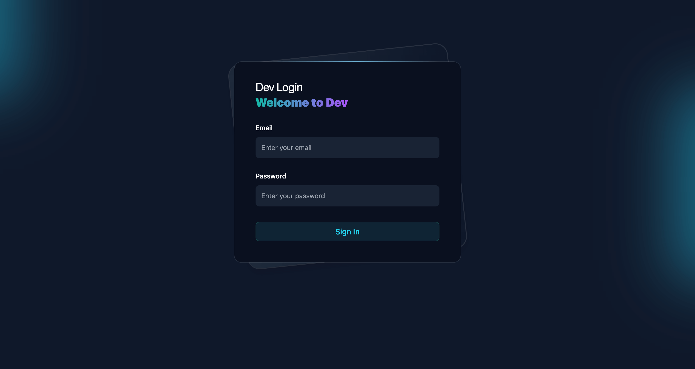

<h1 align="center">Laravel Developer Login</h1>

[](https://packagist.org/packages/ageekdev/dev-login)
[](https://laravel.com/docs/10.x)
[](https://laravel.com/docs/11.x)
[](https://laravel.com/docs/12.x)
[](https://github.com/ageekdev/laravel-dev-login/actions/workflows/run-tests.yml)
[](https://packagist.org/packages/ageekdev/dev-login)

This package allows you to login the developer associate actions (e.g.log views).



## Installation

You can install this package via composer using this command:

```bash
composer require ageekdev/dev-login
```

The package will automatically register itself.

After installing Dev Login, you may publish its assets using the `dev:install` Artisan command:

```bash
php artisan dev:install
```

## Setup developer account

Setup new dev user account.

```bash
php artisan dev:user
```

## USAGE

Dev Login default login URI is the `/dev/login`.

### UseDevLoginGuard Middleware

Laravel official packages uses `$request->user()` to get the user in gate. The default guard is `user` guard. So You can use UseDevLoginGuard middleware to override this behaviour.

### Telescope

You must replace `Authorize` with `UseDevLoginGuard` middleware applied to Telescope routes in telescope.middleware config value.

`config/telescope.php`
```diff
<?php

- use Laravel\Telescope\Http\Middleware\Authorize;
+ use AgeekDev\DevLogin\Http\Middleware\UseDevLoginGuard;
use Laravel\Telescope\Watchers;

...

'middleware' => [
   'web',
-   Authorize::class,
+   UseDevLoginGuard::class,
],

...
```

### Vapor UI

You must replace `EnsureUserIsAuthorized` with `UseDevLoginGuard` middleware applied to Vapor routes in vapor-ui.middleware config value.

`config/vapor-ui.php`
```diff
<?php

- use Laravel\VaporUi\Http\Middleware\EnsureUserIsAuthorized;
+ use AgeekDev\DevLogin\Http\Middleware\UseDevLoginGuard;
use Laravel\Telescope\Watchers;

...

'middleware' => [
   'web',
-   EnsureUserIsAuthorized::class,
+   UseDevLoginGuard::class,
],

...
```

## Testing

You can run the tests with:

```bash
composer test
```

## Changelog

Please see [CHANGELOG](CHANGELOG.md) for more information on what has changed recently.

## Contributing

Please see [CONTRIBUTING](.github/CONTRIBUTING.md) for details.

## Security Vulnerabilities

Please review [our security policy](../../security/policy) on how to report security vulnerabilities.

## License

The MIT License (MIT). Please see [License File](LICENSE.md) for more information.
